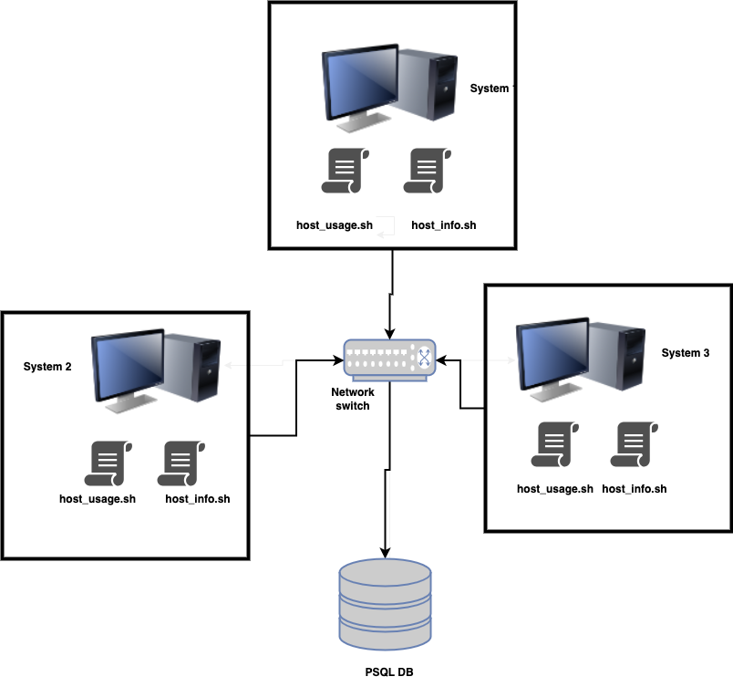

# Linux Cluster Monitoring Agent
## introduction
The purpose of this project is to collect hardware specification and also monitor the cluster nodes resource usage in real time. The collected data will be stored in an RDBMS database for this we use posgres sql database. These data can help to manage reports for future resource planning purposes.

## Architecture
### Cluster Diagram

Three nodes/servers to demonstrate, they are connected through switch. On each server, there are two bash scripts, host_info.sh and host_usage.sh
host_info to collect host hardware information
hoset_info.sh collect current host usage information
those two scripts install in every server.
collect data and send them to Postgreas sql

## implementation
- psql instance , used to persist all the data
- host_info.sh collects the host hardware info and insert it into the database. 
- host_usage.sh collects the current host usage (CPU and Memory) and then insert into the database.
- crontab tool from LINUX  , which enable us to trigger host_usage.sh every minute 
